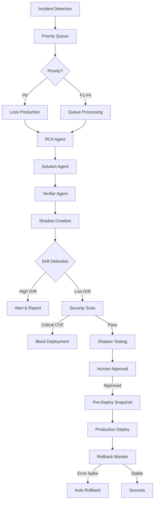

# 🛡️ AEGIS (Autonomous Enhanced Gorilla Incident System)

**AI-Powered SRE Agent with Shadow Verification, Priority Queue, and Automatic Rollback**

> [!NOTE]
> AEGIS is an intelligent Kubernetes incident response system that autonomously detects, analyzes, and remediates issues using multi-agent AI workflows, shadow verification, and safety gates.

---

## ✨ Key Features

### 🤖 Multi-Agent AI Workflow
- **RCA Agent**: Root cause analysis powered by Groq
- **Solution Agent**: Fix proposal generation with Gemini
- **Verifier Agent**: Validation and testing strategies
- **Rollback Agent**: Automatic rollback on production degradation

### 🔬 Shadow Verification
- Isolated test environments using vCluster
- Pre-deployment drift detection
- Security scanning (Kubesec integration)
- Smoke + load testing before production

### 🚦 Priority Queue System
- **P0 (Critical)**: Locks production, immediate processing
- **P1-P4**: Graduated priority handling
- Incident correlation and deduplication
- Concurrent incident locking

### 🔄 Automatic Rollback
- Pre-deployment snapshot capture
- Error rate baseline measurement
- Real-time production monitoring (5min window)
- Automatic rollback on >20% error rate spike

### 🔐 Security Gates
- Pre-shadow vulnerability scanning
- Critical CVE blocking
- Pre-production security validation
- Compliance enforcement

### 📊 Enhanced Observability
- 15+ Prometheus metrics
- Queue depth tracking
- Rollback success rates
- Drift detection metrics

---

## 🏗️ Architecture



---

## 🚀 Quick Start

### Prerequisites

```bash
# Kubernetes cluster (kind, minikube, or production)
kind create cluster --name aegis-demo

# API Keys
export GROQ_API_KEY="your-groq-key"        # RCA agent
export GEMINI_API_KEY="your-gemini-key"    # Solution agent
```

### Installation

```bash
# Clone repository
git clone https://github.com/your-org/unifonic-hackathon.git
cd unifonic-hackathon

# Install dependencies
uv sync

# Activate virtual environment
source .venv/bin/activate

# Apply CRDs and deploy operator
kubectl apply -f deploy/crds/
kubectl apply -f deploy/operator/
```

### Configuration

Create `.env` file:

```bash
# LLM Configuration
AGENT__RCA_PROVIDER=groq
AGENT__RCA_MODEL=llama-3.1-70b-versatile
AGENT__SOLUTION_PROVIDER=gemini
AGENT__SOLUTION_MODEL=gemini-2.0-flash-exp

# Shadow Verification
SHADOW__RUNTIME=vcluster
SHADOW__AUTO_CLEANUP=true
SHADOW__VERIFICATION_TIMEOUT=300

# Rollback
OBSERVABILITY__ROLLBACK_ENABLED=true
OBSERVABILITY__ROLLBACK_ERROR_RATE_THRESHOLD=0.20
OBSERVABILITY__ROLLBACK_MONITORING_WINDOW_MINUTES=5

# Security
SHADOW__SECURITY_SCAN_ENABLED=true
```

---

## 📖 Usage

### CLI Commands

#### Incident Analysis

```bash
# Analyze a failing deployment
aegis analyze deployment/api -n production

# Analyze a crashing pod
aegis analyze pod/worker-xyz -n production

# Auto-run shadow verification
aegis analyze deployment/api -n production --verify
```

#### Queue Management

```bash
# Check queue status
aegis queue status

# View production lock
aegis queue status | grep "PRODUCTION LOCKED"

# Manual unlock (CAUTION!)
aegis queue unlock --force
```

#### Shadow Environments

```bash
# List all shadows
aegis shadow list

# Create manual shadow
aegis shadow create deployment/api -n production --wait

# Check shadow status
aegis shadow status shadow-api-20260205-123456

# Delete shadow
aegis shadow delete shadow-api-20260205-123456
```

#### Rollback

```bash
# Manual rollback (requires snapshot ID)
aegis rollback deployment/api --snapshot snapshot-20260205-123456 -n production
```

---

## 🧪 Complete Workflow Example

```bash
# 1. Incident is detected automatically (via operator)
#    OR manually trigger analysis:
aegis analyze deployment broken-app -n production

# 2. Review RCA results
# Output shows:
#   - Root cause: ConfigMap missing required key
#   - Confidence: 94%

# 3. Review proposed fix
# Agent suggests:
#   - Add missing 'DATABASE_URL' key to ConfigMap

# 4. Shadow verification starts automatically
# Output shows:
#   ✓ Shadow created: shadow-broken-app-20260205-073015
#   ✓ Drift detection: LOW (replica count differs)
#   ✓ Security scan: PASSED
#   ✓ Smoke tests: 5/5 PASSED
#   ✓ Load tests: P99 45ms PASSED

# 5. Human approval prompt appears:
===============================================================================
SHADOW VERIFICATION COMPLETED - PRODUCTION APPROVAL REQUIRED
===============================================================================

Incident ID: incident-abc-123
Resource: Deployment/broken-app
Namespace: production

FIX PROPOSAL:
  Type: ConfigChange
  Description: Add missing DATABASE_URL to ConfigMap
  Confidence: 94.2%

SHADOW VERIFICATION RESULTS:
  ✓ Security Scans: PASSED
  ✓ Smoke Tests: PASSED (5/5)
  ✓ Load Tests: PASSED (p99: 45ms)

===============================================================================

Apply fix to production? [yes/no]: yes

# 6. Production deployment proceeds
#   ✓ Pre-deployment snapshot captured
#   ✓ ConfigMap updated
#   ✓ Deployment rolled out

# 7. Rollback monitoring (automatic for 5 minutes)
#   Monitoring error rates...
#   Baseline: 2.1%
#   Current: 1.8%
#   Status: STABLE ✓
```

---

## 🛡️ Security & Safety

### Production Locks

When a **P0 (Critical)** incident is detected:

- ✅ Production deployments are automatically **locked**
- ✅ New fixes are queued until P0 is resolved
- ✅ Prevents cascading failures

**Manual unlock** (use with extreme caution):
```bash
aegis queue unlock --force
```

### Security Gates

Deployments are **blocked** if:

- ❌ Critical CVEs detected (CVSS >= 9.0)
- ❌ Kubesec score < 5
- ❌ Shadow verification fails

### Automatic Rollback

AEGIS monitors production for **5 minutes** after deployment:

- **Baseline** error rate captured pre-deployment
- **Real-time** monitoring via Prometheus
- **Auto-rollback** if error rate spikes >20%

```bash
# Rollback trigger example:
# Baseline: 1.5% errors
# Spike detected: 12.0% errors (800% increase)
# → Automatic rollback initiated
# → Snapshot restored
# → Incident escalated
```

---

## 📊 Metrics & Monitoring

### Key Prometheus Metrics

```promql
# Incident Queue
aegis_incident_queue_depth{priority="p0"}
aegis_incident_queue_processing_time_seconds

# Shadow Verification
aegis_shadow_retries_total{outcome="success"}
aegis_drift_detections_total{severity="high"}

# Security
aegis_security_blocks_total{severity="CRITICAL"}

# Rollback
aegis_rollbacks_total{reason="error_rate_spike"}
aegis_rollback_success_total
```

### Grafana Dashboards

Access dashboards at `http://grafana:3000`:

1. **Incident Response Overview**
2. **Shadow Verification Stats**
3. **Rollback Monitoring**
4. **Security Gate Status**

---

## 🧩 Components

### Operator

Kubernetes operator built with [Kopf](https://kopf.readthedocs.io/):

- Watches Pods, Deployments, K8sGPT Results
- Enqueues incidents with priority
- Orchestrates shadow verification
- Manages production approvals

**Run operator**:
```bash
aegis operator run -n production
```

### LangGraph Workflow

Multi-agent workflow orchestration:

```python
START → rca_agent → solution_agent → verifier_agent →
[shadow_verification] → [human_approval] → [production_deployment] →
rollback_monitor → END
```

### Shadow Manager

vCluster-based isolated environments:

- **Create** shadow from production
- **Detect** configuration drift
- **Apply** proposed fixes
- **Test** smoke + load
- **Cleanup** automatically

### Incident Queue

Priority-based processing:

- **P0**: Critical (locks production)
- **P1**: High (immediate)
- **P2**: Medium
- **P3**: Low
- **P4**: Info

**Correlation**: Deduplicate related incidents
**Locking**: Prevent concurrent production changes

---

## 📚 Documentation

- [**Runbook**](docs/runbooks/incident-response.md): Step-by-step incident response procedures
- [**Architecture**](docs/architecture/enhanced-sre-system.md): Detailed system design
- [**Demo Scenarios**](docs/hackathon-scenarios.md): Hackathon demonstrations

---

## 🧪 Testing

### Run Unit Tests

```bash
# All tests
pytest tests/unit/

# Specific components
pytest tests/unit/test_rollback_agent.py
pytest tests/unit/test_drift_detector.py
pytest tests/unit/test_incident_queue.py
```

### Integration Tests

```bash
# Full workflow test
pytest tests/integration/test_workflow.py

# Shadow verification
pytest tests/integration/test_shadow_verification.py
```

---

## 🔧 Troubleshooting

### Common Issues

**Incidents not processing?**
```bash
# Check operator status
kubectl logs -f deployment/aegis-operator -n aegis-system

# Verify queue
aegis queue status

# Check LLM connectivity
aegis operator status
```

**Shadow verification failing?**
```bash
# Check drift detection
aegis shadow status <shadow-id>

# View shadow logs
kubectl logs -f <shadow-pod> -n shadow-namespace

# Manual cleanup
aegis shadow delete <shadow-id> --force
```

**Rollback not triggering?**
```bash
# Check monitoring logs
kubectl logs deployment/aegis-operator | grep rollback_agent

# Verify Prometheus connectivity
curl http://prometheus:9090/api/v1/query?query=up
```

See [**Runbook**](docs/runbooks/incident-response.md) for detailed troubleshooting.

---

## 🤝 Contributing

We welcome contributions! Please see [CONTRIBUTING.md](CONTRIBUTING.md).

### Development Setup

```bash
# Install development dependencies
uv sync --extra dev

# Install pre-commit hooks
pre-commit install

# Run linter
ruff check src/

# Run type checker
mypy src/
```

---

## 📄 License

Apache 2.0 License - see [LICENSE](LICENSE)

---

## 🌟 Acknowledgments

Built for the **Unifonic Hackathon 2026** by Team AEGIS.

**Technologies**:
- [Kubernetes](https://kubernetes.io/)
- [Kopf](https://kopf.readthedocs.io/)
- [LangGraph](https://langchain-ai.github.io/langgraph/)
- [vCluster](https://www.vcluster.com/)
- [Groq](https://groq.com/)
- [Google Gemini](https://ai.google.dev/)

---

**AEGIS**: _Autonomous Enhanced Gorilla Incident System_
> _"Because even gorillas need AI-powered incident response."_ 🦍🤖
