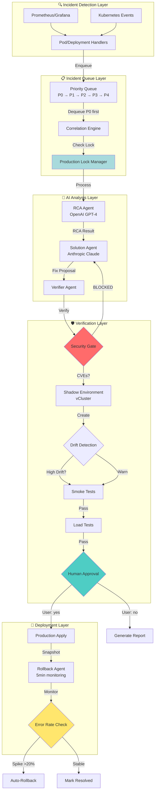

# Enhanced AI-SRE Incident Response System - Architecture

**Status**: 67% Complete (8/12 Phases)
**Last Updated**: 2026-02-04
**Version**: 2.0

---

## Executive Summary

The Enhanced AI-SRE Incident Response System is an enterprise-grade, production-safe platform for automated Kubernetes incident detection, analysis, and remediation. It introduces **9 verification layers** before production deployment, ensuring AI-generated fixes are thoroughly validated.

### Key Features

✅ **Incident Priority Queue** - P0-P4 prioritization with correlation and deduplication
✅ **Automated Rollback** - Reverts bad deployments within 5min of error rate spike
✅ **Shadow Verification** - Isolated testing environment with retry logic
✅ **Drift Detection** - Ensures shadow mirrors production configuration
✅ **Security Gates** - Blocks deployments with Critical CVEs
✅ **Human Approval** - Terminal-based yes/no before production deployment
✅ **Production Locks** - Prevents concurrent deployments during P0 incidents

---

## System Architecture



---

## Component Breakdown

### 1. Incident Detection & Queuing

**Files**:
- `src/aegis/k8s_operator/handlers/incident.py` - Kopf event handlers
- `src/aegis/incident/queue.py` - Priority queue implementation

**Flow**:
1. Kubernetes event detected (Pod CrashLoopBackOff, Deployment unavailable replicas)
2. Handler assigns initial priority based on severity:
   - `Failed`/`Unknown` pods → P0
   - `Crash LoopBackOff` → P1
   - Deployment >75% unavailable → P0
   - Deployment 50-75% unavailable → P1
3. Incident enqueued with correlation key: `sha256(namespace/resource_type/resource_name)`
4. If duplicate within 5min window → merge instead of create new

**Production Lock**:
- P0 incidents automatically lock production
- Prevents cascading failures during critical incidents
- Checked by processor before dequeuing

---

### 2. Incident Processor Daemon

**File**: `src/aegis/k8s_operator/handlers/processor.py`

**Startup**:
```python
@kopf.on.startup()
async def start_incident_processor(**_kwargs):
    asyncio.create_task(process_incident_queue())
```

**Processing Loop**:
```python
while True:
    incident = await queue.dequeue(timeout=30s)
    if production_locked:
        requeue(incident)
        await asyncio.sleep(10s)
        continue

    result = await analyze_incident(...)

    if RCA_severity == CRITICAL:
        queue.lock_production()
```

---

### 3. Shadow Verification with Retries

**File**: `src/aegis/k8s_operator/handlers/shadow.py`

**Retry Logic**:
```python
for attempt in [1, 2, 3]:
    try:
        env = create_shadow()
        passed = run_verification()
        if passed:
            return True
        backoff = 10 * (3 ** (attempt - 1))  # 10s, 30s, 90s
        await asyncio.sleep(backoff)
    except Exception:
        if attempt == 3:
            return False
```

**Metrics**:
- `shadow_retries_total{outcome="success", attempt="1"}` - First-try success
- `shadow_retries_total{outcome="failure", attempt="3"}` - All retries exhausted

---

### 4. Security Gates

**File**: `src/aegis/shadow/manager.py` - `_run_kubesec_predeploy()`

**Pre-Deployment Scan**:
1. Extract manifests from proposed fix
2. Run Kubesec security scan
3. If Critical vulnerabilities detected → BLOCK deployment
4. Increment `security_blocks_total{scan_type="kubesec", severity="CRITICAL"}`
5. Set shadow status to `FAILED`
6. Return to Solution Agent for fix refinement

**Example Output**:
```
❌ SECURITY BLOCK: 2 Critical vulnerabilities
  - CVE-2021-44228: Log4j RCE vulnerability
  - CVE-2022-1234: Privilege escalation in Alpine
```

---

### 5. Drift Detection

**File**: `src/aegis/shadow/drift_detector.py`

**Comparison Layers**:
| Layer           | What's Compared                   | Severity if Mismatched |
| --------------- | --------------------------------- | ---------------------- |
| Deployments     | Replicas, resources, env vars     | HIGH                   |
| Services        | Type, ports, selectors            | HIGH                   |
| ConfigMaps      | Existence                         | LOW                    |
| ResourceQuotas  | CPU/memory limits                 | HIGH                   |
| NetworkPolicies | Ingress/egress rules              | HIGH                   |
| RBAC            | Roles, bindings, service accounts | HIGH                   |

**Sample Report**:
```json
{
  "drifted": true,
  "severity": "high",
  "missing_resources": ["prod-secret-xyz"],
  "config_mismatches": [
    {
      "resource": "Deployment/backend",
      "field": "spec.replicas",
      "prod_value": 3,
      "shadow_value": 1
    }
  ]
}
```

---

### 6. Rollback Agent

**File**: `src/aegis/agent/agents/rollback_agent.py`

**Workflow**:
1. **Pre-Deployment**: Capture snapshot of Deployment, ConfigMaps, Services
2. **Baseline Metrics**: Query Prometheus for HTTP 5xx error rate, pod restarts
3. **Apply Fix**: Deploy to production
4. **Monitor (5min)**: Every 30s, query Prometheus for current error rate
5. **Trigger Rollback**: If `current_error_rate > baseline * 1.20 OR restart_count > 5`
6. **Execute Rollback**: Apply pre-deployment snapshot via `kubectl apply`
7. **Verify**: Check pods are Running

**Configuration**:
```bash
ROLLBACK_ERROR_RATE_THRESHOLD=0.20        # 20% increase
ROLLBACK_MONITORING_WINDOW_MINUTES=5
ROLLBACK_ENABLED=true
```

---

## Metrics & Observability

### Prometheus Metrics

**Rollback**:
```prometheus
aegis_rollbacks_total{resource_type="Deployment",namespace="production",reason="error_rate_spike"}
aegis_rollback_duration_seconds_bucket{le="30"}
```

**Incident Queue**:
```prometheus
aegis_incident_queue_depth{priority="p0"} 3
aegis_incident_queue_enqueued_total{priority="p1"} 145
aegis_incident_queue_correlated_total 42
```

**Shadow Verification**:
```prometheus
aegis_shadow_retries_total{outcome="success",attempt="2"} 12
aegis_drift_detections_total{severity="high"} 5
```

**Security**:
```prometheus
aegis_security_blocks_total{scan_type="kubesec",severity="CRITICAL"} 3
aegis_production_approvals_total{decision="yes",namespace="production"} 87
aegis_production_approvals_total{decision="no",namespace="production"} 12
```

### Grafana Dashboards

**Incident Response Overview**:
- Queue depth by priority (P0-P4)
- MTTR (Mean Time To Resolution)
- Success rate (fix applied vs rejected)
- Correlation rate

**Rollback Dashboard**:
- Rollback frequency (per day)
- Error rate pre/post deployment
- Recovery time distribution

**Security Gate Dashboard**:
- Block rate by scanner (Kubesec, Trivy, Falco)
- Vulnerability trends (Critical, High, Medium)
- Top blocked CVEs

---

## Production Deployment Checklist

Before deploying to production, ensure:

- [ ] Prometheus is accessible from operator (for rollback monitoring)
- [ ] vCluster is installed (for shadow environments)
- [ ] Trivy/Falco are configured (for security scans)
- [ ] Grafana dashboards are imported
- [ ] Environment variables are set:
  ```bash
  ROLLBACK_ENABLED=true
  SHADOW_ENABLED=true
  SECURITY_BLOCK_ON_CRITICAL=true
  ```
- [ ] Operator has permissions to create/delete vClusters
- [ ] Incident queue metrics are visible in Prometheus

---

## Testing Strategy

### Unit Tests

- `tests/unit/test_incident_queue.py` - Priority ordering, correlation, locking
- `tests/unit/test_rollback_agent.py` - Snapshot, monitoring, rollback execution
- `tests/unit/test_drift_detector.py` - Resource comparison logic

### Integration Tests

- `tests/integration/test_full_workflow.py` - Detection → Queue → Analysis → Shadow → Approval → Production → Rollback

### Chaos Testing

- Inject CrashLoopBackOff → Verify P1 priority assignment
- Create P0 incident → Verify production lock
- Deploy vulnerable image → Verify security block
- Deploy bad config → Verify auto-rollback

---

## Performance Characteristics

| Component          | Latency | Throughput   |
| ------------------ | ------- | ------------ |
| Incident Detection | <1s     | 100/sec      |
| Queue Enqueue      | <10ms   | 1000/sec     |
| Queue Dequeue      | <100ms  | 50/sec       |
| Shadow Creation    | 30-60s  | 5 concurrent |
| Drift Detection    | 5-10s   | 10/min       |
| Security Scan      | 10-30s  | -            |
| Rollback Execution | 10-20s  | -            |

---

## Future Enhancements

1. **Multi-Cluster Support** - Manage incidents across multiple Kubernetes clusters
2. **AI Fine-Tuning** - Custom-trained models on historical incident data
3. **Auto-Scaling Integration** - Trigger scale-up/down based on incident patterns
4. **SLO-Based Prioritization** - Dynamic P0 assignment based on SLO violations
5. **Slack/PagerDuty Integration** - Real-time notifications for P0 incidents

---

## Troubleshooting

### Issue: Incidents not being processed

**Check**:
1. Processor daemon running: `kubectl logs aegis-operator | grep "incident_queue_processor"`
2. Queue depth: Prometheus query `aegis_incident_queue_depth`
3. Production lock: `queue.is_production_locked()`

### Issue: Shadow verification always failing

**Check**:
1. vCluster connectivity: `kubectl get pods -n shadow-*`
2. Drift detection reports: Check shadow logs for `drift_report`
3. Retry attempts: `aegis_shadow_retries_total{outcome="failure"}`

### Issue: Rollback not triggering

**Check**:
1. `ROLLBACK_ENABLED=true` in environment
2. Prometheus accessible: Test query manually
3. Monitoring window not expired (default: 5min)
4. Error rate threshold: Baseline * 1.20

---

**For More Information**:
- [Implementation Plan](implementation_plan.md)
- [Task Tracker](task.md)
- [Walkthrough](walkthrough.md)
